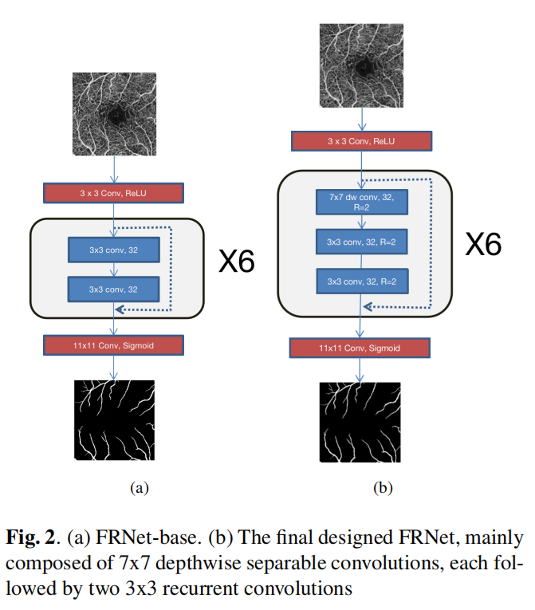

# FRNet

FRNet is a simple and efficient vessel segmentation network for OCTA images. It can achieve performance close to the SOTA method with only about 100k parameters. The model takes up less than 1MB of storage on the disk.

<figure class="half">
    
</figure>

# The ROSSA Dataset
ROSSA is a retinal OCTA vessel segmentation dataset semi-automatically annotations created by us using Segmentation Anything Model(SAM), which contains 918 images. It is stored in the dataset/ROSSA folder of this warehouse, in which:

`train_manual` contains 100 images (NO.1-NO.100) that we manually annotated, using as training set.

`train_sam` contains 618 images (NO.301-NO.918) that are semi-automatically annotated using SAM, also using as training set.

`val` contains 100 images (NO.101-NO.200) that we manually annotated, , using as validation set.

`test` contains 100 images (NO.201-NO.300) that we manually annotated, , using as test set.

# Run
```
git clone https://github.com/nhjydywd/OCTA-FRNet
cd OCTA-FRNet
pip install -r requirements.txt
python run_benchmark.py
```
The current version of the code contains 2 models: `FRNet-base` and `FRNet`, and 3 datasets: `ROSSA`, `OCTA_500 (3M)` and `OCTA_500 (6M)`.

By running run_benchmark.py, 2 models on 3 datasets will be trained and evaluated at once (that is, a total of 2x3=6 results).

The results will be saved in `json` format to the `result` folder.

# Configure Datasets
If you have more datasets to run, you can configure it in `datasets.py`, in function `prepareDatasets`:
```
def prepareDatasets():
    all_datasets = {}
    
    // Add your datasets here
    // ......

    return all_datasets
```
Note that your dataset should follow the given structure:
```
--dataset
    |
    |--Your Dataset
        |
        |--train
        |--val
        |--test
```
where each folder in `train`, `val`, `test` should follow the given format:( take `train` as an example)
```
--train
    |
    |--image
    |    |
    |    |--......(images)
    |    |--......
    |    |.......
    |--label
        |
        |--......(labels)
        |--......
        |......
```
# Configure Models
If you have more models to run, please modify the `models` variable in `settings_benchmark.py`:
```
models = {
    # More models can be added here......
}
```
Each item in models must be of type `ObjectCreator`, in which your model can be created.

# Citation
```
@misc{ning2023accurate,
      title={An Accurate and Efficient Neural Network for OCTA Vessel Segmentation and a New Dataset}, 
      author={Haojian Ning and Chengliang Wang and Xinrun Chen and Shiying Li},
      year={2023},
      eprint={2309.09483},
      archivePrefix={arXiv},
      primaryClass={eess.IV}
}
```

# Thanks
The OCTA-500 Dataset: [IPN-V2 and OCTA-500: Methodology and Dataset for Retinal Image Segmentation](https://www.semanticscholar.org/paper/IPN-V2-and-OCTA-500%3A-Methodology-and-Dataset-for-Li-Zhang/3dfd924ad26e737db805ed29af61cc827e876bd9)

Segmentation Anything Model (SAM): https://github.com/facebookresearch/segment-anything

